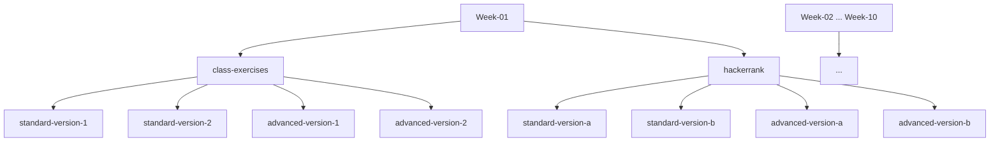

<div align="center">
  <h1>🌟 TIP Class Assignments 🌟</h1>
  <p><em>All weekly assignments and exercises for the TIP course, beautifully organized.</em></p>
  
  
</div>

---

## 📚 Overview

Welcome! This repository contains all class exercises and HackerRank problems for the TIP course, organized by week and version for easy navigation and collaboration.

---

## 🗂️ Directory Structure

```plaintext
TIP-class-assignments/
├── Week-01/
│   ├── class-exercises/
│   │   ├── standard-version-1/
│   │   ├── standard-version-2/
│   │   ├── advanced-version-1/
│   │   └── advanced-version-2/
│   └── hackerrank/
│       ├── standard-version-a/
│       ├── standard-version-b/
│       ├── advanced-version-a/
│       └── advanced-version-b/
├── Week-02/
│   └── ...
└── README.md
```

---

## 📝 About This Repo

- **Class Exercises:** Standard and advanced versions for each week
- **HackerRank Problems:** Standard and advanced versions for each week
- **Easy Navigation:** Everything is grouped by week and type

---

## 🚀 Quick Start

```sh
git clone https://github.com/jellyfishing2346/TIP-class-assignments.git
cd TIP-class-assignments
```

1. Browse to the week and exercise you want to work on.
2. Add your solutions in the appropriate folder.
3. Commit and push your changes!

---

## 🗺️ Visual Structure



---

## ✨ Tips for Contributors

- Keep your code clean and well-commented.
- Use meaningful commit messages.
- Organize new files in the correct week/version folder.
- Feel free to add your own notes or solutions!

---

## 📄 License

This project is licensed under the MIT License. See the [LICENSE](LICENSE) file for details.

---

<div align="center">
  <sub>Created by <a href="https://github.com/jellyfishing2346">Faizan Khan</a> for the TIP 102 course, Fall 2025</sub>
</div>
